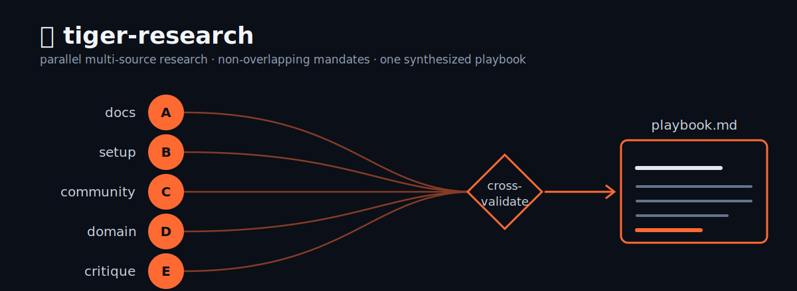

<div align="center">


# tiger-research

**Parallel multi-source research for AI agents.** Spawn N specialized
"tigers", each with a non-overlapping mandate and tool preference, then
synthesize their findings into one cross-validated playbook.



</div>

---

## Why

One research pass is biased toward the first angle it finds. It reads
the docs, or the community, or your config, and writes that up as if it
were the whole picture. The gaps are invisible because nothing
contradicted them.

tiger-research attacks a question from several independent directions at
once. A docs tiger, a setup tiger, a community tiger, a domain tiger, a
critique tiger, each with its own sources and tools, none duplicating
another's scope. Where they agree, you get high confidence. Where they
disagree, you get an explicit flag instead of a smoothed-over guess. And
the synthesis is weighted by your actual situation, not generic
best-practice advice.

## What it is

A portable agent **skill** (prompt + process, no dependencies). Drop it
into a host that can spawn parallel agents. It ships with:

- **7 tiger archetypes** (docs, setup, community, domain, critique,
  pattern, project-context) with defined mandates and output shapes
- **Pre-built grids** for common research shapes (architecture review,
  legal/tax document critique, strategic decision, content strategy,
  audit, quick-pass, deep-dive)
- **Synthesis rules** that cross-validate, weight by user context, and
  refuse to bury uncertainty
- **Host adapters** for Claude Code and OpenClaw-style runtimes

## Install

**Claude Code** — copy into your skills directory:

```bash
git clone https://github.com/merlinrabens/tiger-research.git
cp -r tiger-research ~/.claude/skills/tiger-research
```

**OpenClaw-style host** — place under the host's skills path and ensure
the spawn-depth limit allows the orchestrator pattern (see
`templates/spawn-openclaw.md`).

Then invoke with phrases like *"tiger research on X"*, *"deep dive on
X"*, *"perspective check on X"*, or *"pull every source for X"*.

## How it works

```
question
   │
   ├─►  🐯 A  docs        ┐
   ├─►  🐯 B  setup       │  parallel, non-overlapping,
   ├─►  🐯 C  community   ├─ each cites every claim,
   ├─►  🐯 D  domain      │  each flags what it couldn't verify
   └─►  🐯 E  critique    ┘
                          │
                   cross-validate  (3+ agree → lead · disagree → flag)
                          │
                   workspace/research/{slug}/playbook.md
                   + per-tiger raw transcripts (auditable)
```

Full method in [`SKILL.md`](SKILL.md). Synthesis discipline in
[`references/synthesis-rules.md`](references/synthesis-rules.md). Grids
in [`references/grid-templates.md`](references/grid-templates.md).

## Design principles

- **Multiple independent angles beat one thorough one.**
- **Non-overlapping scope** — one source type per tiger, or it's wasted
  parallelism.
- **Honesty about confidence** — "couldn't verify" is a first-class
  output, never dropped, never upgraded to a claim.
- **Personalization is the point** — generic advice that contradicts
  your real constraints gets demoted.
- **No padding** — length follows evidence.

## License

[MIT](LICENSE). Use it, fork it, adapt it to your runtime.
